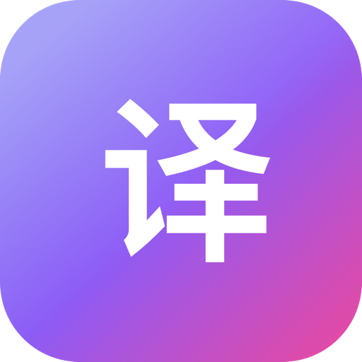

<p align="center">
  
</p>

<h1 align="center">EasyTranslate · 浏览器翻译工具箱</h1>

<p align="center"><a href="#中文">中文</a> · <a href="#english">English</a></p>

---

## 中文

> 自动语言检测 · 划词翻译 · 输入翻译 · 密码生成 · Base64 · JSON 格式化

轻量、美观的浏览器扩展（Chrome / Edge，Manifest V3）。深浅色主题、翻译历史、统一的 Toast 反馈，基于 **Vite + @crxjs/vite-plugin** 构建。

### 功能

| 功能 | 说明 |
| --- | --- |
| 🌐 翻译 | 自动检测中/英文，输入即时翻译；支持划词图标、右键菜单翻译；保留最近 30 条历史记录，点击可回填 |
| 🔐 密码生成器 | 加密安全随机数生成，可选数字/大小写/符号、长度 8–64、排除字符，实时强度评估 |
| 🔁 Base64 | 支持 Unicode 的编码 / 解码，格式校验 |
| `{ }` JSON | 格式化 / 压缩 / 校验，友好错误定位，独立全屏页面，字符·行数·大小统计 |

界面支持 **深色 / 浅色主题切换**（记忆偏好），首次根据系统配色自动适配。

### 使用教程

**翻译**
1. 点击浏览器工具栏上的 EasyTranslate 图标打开弹窗。
2. 在输入框中粘贴或输入文字，松手即自动检测语言并翻译；也可点击语言下拉框手动切换源/目标语言，点击中间的 ⇄ 按钮互换方向。
3. 在任意网页选中一段文字，会出现划词翻译图标，点击即可在页面内直接看到译文；也可右键选中文字，从菜单中选择「翻译」。
4. 弹窗下方的「历史记录」保存最近 30 条翻译，点击任意一条可重新填入输入框。

**密码生成器**
1. 切换到「密码」Tab。
2. 通过开关勾选是否包含数字 / 大小写字母 / 符号，用滑块或输入框设置长度（8–64 位），也可填写需要排除的字符。
3. 点击「生成」，强度条会实时显示当前密码强度；点击「复制」一键拷贝。

**Base64**
1. 切换到「Base64」Tab。
2. 在编码框输入原文，点击「编码」得到 Base64 字符串；或反向粘贴 Base64 字符串点击「解码」，支持 Unicode（中文）。

**JSON 工具**
1. 切换到「JSON」Tab，或点击「在新窗口打开」进入独立全屏页面。
2. 粘贴 JSON 文本，点击「格式化」美化缩进，或「压缩」去除空白；点击「校验」检查语法，错误会标出具体行列。
3. 全屏页面提供左右双栏：左侧文本编辑，右侧树形视图可逐级展开/折叠。

### 安装到浏览器

1. 运行 `npm install && npm run build` 生成 `dist/`（仓库已附带一份构建产物，可跳过此步）。
2. 打开 `chrome://extensions`，开启右上角「开发者模式」。
3. 点击「加载已解压的扩展程序」，选择本项目的 **`dist/`** 目录。
4. 也可直接从 [GitHub Releases](https://github.com/damoguyansi/EasyTranslate/releases) 下载打包好的 `EasyTranslate-chrome-vx.x.x.zip`，解压后按上述步骤加载。

### 项目结构

```
src/
  popup/        弹窗页面（HTML + CSS + 控制器）
  json-page/    独立 JSON 格式化全屏页
  content/      划词翻译内容脚本与样式
  background/   Service Worker（右键菜单）
  lib/          纯逻辑模块：translate / language / password / base64 / json / storage / ui
  styles/       设计系统（设计令牌 + 组件）
manifest.config.js   由 @crxjs 生成 manifest
vite.config.js       构建配置
```

### 开发

```bash
npm install      # 安装依赖
npm run dev      # 开发模式（HMR）
npm run build    # 生产构建，输出到 dist/
```

### 技术栈

原生 JavaScript（ES Modules）· Vite 5 · @crxjs/vite-plugin 2 · Chrome Manifest V3 · 微软 Edge 翻译接口。

---

## English

> Automatic language detection · selection-translate · input translate · password generator · Base64 · JSON formatter

A lightweight, good-looking browser extension (Chrome / Edge, Manifest V3) with light/dark theme, translation history, and consistent toast feedback, built with **Vite + @crxjs/vite-plugin**.

### Features

| Feature | Description |
| --- | --- |
| 🌐 Translate | Auto-detects Chinese/English and translates as you type; selection-translate icon and right-click context menu on any page; keeps the last 30 translations, click one to refill the input |
| 🔐 Password generator | Cryptographically secure random passwords, toggle digits/upper-lower case/symbols, length 8–64, character exclusion, live strength meter |
| 🔁 Base64 | Unicode-safe encode/decode with format validation |
| `{ }` JSON | Format / minify / validate with friendly error location, standalone full-screen page, character·line·size stats |

The UI supports **light/dark theme switching** (preference remembered), auto-matching the system color scheme on first run.

### Usage guide

**Translate**
1. Click the EasyTranslate icon in the browser toolbar to open the popup.
2. Paste or type text in the input box — language is detected and translated automatically on release. Use the language dropdowns to pick source/target manually, or the ⇄ button in the middle to swap direction.
3. Select any text on a web page to reveal a selection-translate icon; click it to see the translation inline. You can also right-click selected text and choose "Translate" from the context menu.
4. The "History" panel below the input keeps your last 30 translations — click any entry to refill the input.

**Password generator**
1. Switch to the "Password" tab.
2. Toggle digits / upper-lower case / symbols, set length with the slider or input field (8–64 characters), optionally exclude specific characters.
3. Click "Generate" — a strength meter updates live; click "Copy" to copy the result.

**Base64**
1. Switch to the "Base64" tab.
2. Type plain text and click "Encode" to get a Base64 string, or paste a Base64 string and click "Decode" — Unicode (e.g. Chinese) is fully supported.

**JSON tool**
1. Switch to the "JSON" tab, or click "Open in new window" for a standalone full-screen page.
2. Paste JSON text, click "Format" to pretty-print with indentation, or "Compress" to strip whitespace. "Validate" checks syntax and points to the exact line/column of any error.
3. The full-screen page offers a two-pane layout: a text editor on the left and a collapsible tree view on the right.

### Installing in the browser

1. Run `npm install && npm run build` to produce `dist/` (a prebuilt copy already ships in the repo, so this step is optional).
2. Open `chrome://extensions` and enable "Developer mode" in the top right.
3. Click "Load unpacked" and select this project's **`dist/`** folder.
4. Alternatively, download the prebuilt `EasyTranslate-chrome-vx.x.x.zip` from [GitHub Releases](https://github.com/damoguyansi/EasyTranslate/releases), unzip it, then follow the steps above.

### Project structure

```
src/
  popup/        Popup page (HTML + CSS + controller)
  json-page/    Standalone full-screen JSON formatter page
  content/      Content script and styles for selection-translate
  background/   Service worker (context menu)
  lib/          Pure logic modules: translate / language / password / base64 / json / storage / ui
  styles/       Design system (tokens + components)
manifest.config.js   Manifest generated by @crxjs
vite.config.js       Build config
```

### Development

```bash
npm install      # install dependencies
npm run dev      # dev mode with HMR
npm run build    # production build, output to dist/
```

### Tech stack

Vanilla JavaScript (ES Modules) · Vite 5 · @crxjs/vite-plugin 2 · Chrome Manifest V3 · Microsoft Edge Translate API.

---

欢迎提交 Issue / PR · Issues and PRs welcome: <https://github.com/damoguyansi/EasyTranslate>
