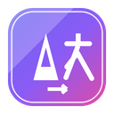

<p align="center">
  
</p>

<h1 align="center">EasyTranslate · macOS 菜单栏工具箱</h1>

<p align="center"><a href="#中文">中文</a> · <a href="#english">English</a></p>

---

## 中文

> 翻译 · 密码 · Base64 · JSON · 划词翻译 · 截图标注，常驻 macOS 菜单栏

EasyTranslate 的桌面端，由 [EasyTranslate-chrome](../EasyTranslate-chrome) 浏览器扩展移植而来，使用 Electron 构建为常驻菜单栏的轻量小工具，额外提供全局快捷键、划词翻译、微信式截图标注、窗口置顶等浏览器扩展无法实现的系统级能力。

### 功能

| 功能 | 说明 |
| --- | --- |
| 🌐 翻译 | 自动检测中/英文，输入即时翻译；保留最近 30 条历史记录 |
| 🔐 密码生成器 | 加密安全随机数生成，可选数字/大小写/符号、长度 8–64、排除字符，实时强度评估 |
| 🔁 Base64 | 支持 Unicode 的编码 / 解码，格式校验 |
| `{ }` JSON | 格式化 / 压缩 / 校验、转义/去转义、中文⇄`\u`，可在独立窗口中编辑并支持窗口置顶 |
| ✂️ 截图标注 | 全屏截图，自动识别并高亮屏幕上的窗口，单击即选中该窗口；支持矩形/椭圆/箭头/画笔/马赛克/文字标注，可保存、复制或钉在屏幕上 |
| ⌨️ 全局快捷键 | 随时随地唤出主窗口、划词翻译、截图，无需先切换到本应用 |

### 使用教程

**打开主窗口**
- 点击菜单栏图标，或按下全局快捷键 **⌘⇧T**，弹出 4 个 Tab（翻译 / 密码 / Base64 / JSON）的小窗口；点击窗口外部自动隐藏。

**翻译**
1. 主窗口默认停留在「翻译」Tab，粘贴或输入文字即自动检测语言并翻译。
2. 在任意应用中选中一段文字后按 **⌘⇧Y**：应用会模拟复制选中内容、弹出主窗口并自动填入翻译结果（需要「系统设置 › 隐私与安全性 › 辅助功能」授权 EasyTranslate 才能读取选中文本）。

**密码生成器 / Base64**：与浏览器插件版交互一致，详见 [EasyTranslate-chrome 的使用教程](../EasyTranslate-chrome/README.md#使用教程)。

**JSON 工具**
1. 切换到「JSON」Tab，可直接在小窗口内格式化/压缩/校验；点击「在新窗口打开」可进入更大的独立窗口，左右双栏编辑+树形视图。
2. 独立窗口标题栏（红绿灯按钮同一行）右侧有一个📌图标，点击可将该窗口设为**始终置顶**，方便边查资料边参考 JSON 结构。

**截图标注**（微信式自动选窗）
1. 按下全局快捷键 **⌘⇧Z**，或点击主窗口顶部的剪刀图标，进入全屏截图模式。
2. 移动鼠标（不点击、不拖动）时，鼠标所在的窗口会自动整窗高亮——和微信截图的窗口识别效果一致；单击即可按该窗口边界自动截取。
3. 也可按住鼠标拖拽，手动框选任意矩形区域，拖拽会覆盖自动识别。
4. 选区确定后，使用下方工具栏进行矩形 / 椭圆 / 箭头 / 画笔 / 马赛克 / 文字标注，支持撤销（⌘Z）。
5. 完成后可：✓ 完成并复制到剪贴板（回车）、⬇ 保存为文件、📌 钉在屏幕上（生成一个常驻置顶的小图片窗口，双击或 Esc 关闭）、✕ 取消（Esc）。
6. 首次使用需要在「系统设置 › 隐私与安全性」中依次授权**屏幕录制**（截图本身）与**辅助功能**（识别窗口位置），授权后需重启应用生效。

### 下载安装

从 [GitHub Releases](https://github.com/damoguyansi/EasyTranslate/releases) 下载 `EasyTranslate-x.x.x-universal.dmg`，双击打开后将 EasyTranslate 拖入「应用程序」文件夹。由于未使用付费 Apple 开发者证书签名，首次启动需**右键点击 App → 打开**（或在「系统设置 › 隐私与安全性」中点击「仍要打开」）以跳过 Gatekeeper 拦截。

### 开发与打包

```bash
npm install
npm run dev     # 开发模式（vite + electron 热重载）
npm test        # 运行测试（38 项）
npm run dist    # 打包出 dmg 安装包（universal，输出在 dist/）
```

### 项目结构

```
electron/
  main.js         主进程：窗口管理、全局快捷键、截图/IPC
  preload.cjs     contextBridge 安全桥接
  store.js        基于 electron-store 的本地存储
src/
  popup/          菜单栏弹窗页面
  json-page/      JSON 独立窗口
  capture/        截图标注引擎（canvas）+ 置顶小窗
  styles/         设计系统（与 chrome 版共用设计令牌）
resources/        应用图标、菜单栏模板图标、entitlements
electron-builder.js          打包配置（dmg / icon / 签名）
```

### 技术栈

Electron 32 · Vite 5（多入口构建）· electron-builder（universal dmg）· 原生 Canvas 标注引擎 · AppleScript（窗口识别 / 划词）。

---

## English

> Translate · Password · Base64 · JSON · selection-translate · screenshot annotation, living in your macOS menu bar

The desktop counterpart of [EasyTranslate-chrome](../EasyTranslate-chrome), ported to Electron as a lightweight menu-bar utility. On top of the shared toolset it adds OS-level capabilities a browser extension simply can't offer: global keyboard shortcuts, selection-translate from any app, WeChat-style screenshot annotation, and always-on-top windows.

### Features

| Feature | Description |
| --- | --- |
| 🌐 Translate | Auto-detects Chinese/English and translates as you type; keeps the last 30 translations |
| 🔐 Password generator | Cryptographically secure random passwords, toggle digits/upper-lower case/symbols, length 8–64, character exclusion, live strength meter |
| 🔁 Base64 | Unicode-safe encode/decode with format validation |
| `{ }` JSON | Format / minify / validate, escape/unescape, CJK ⇄ `\u`, editable in a standalone always-on-top window |
| ✂️ Screenshot annotation | Full-screen capture that auto-detects and highlights on-screen windows — click to select one instantly; annotate with rectangle/ellipse/arrow/pen/mosaic/text, then save, copy, or pin to screen |
| ⌨️ Global shortcuts | Summon the main window, selection-translate, or screenshot from anywhere, without switching focus to the app first |

### Usage guide

**Opening the main window**
- Click the menu-bar icon, or press the global shortcut **⌘⇧T**, to pop up the 4-tab window (Translate / Password / Base64 / JSON). Clicking outside the window hides it automatically.

**Translate**
1. The main window opens on the "Translate" tab by default — paste or type text and it's detected and translated automatically.
2. Select text in any app and press **⌘⇧Y**: the app simulates a copy of the selection, pops up the main window, and auto-fills the translation (requires granting EasyTranslate Accessibility permission under System Settings › Privacy & Security to read the selected text).

**Password generator / Base64**: interactions match the browser-extension version — see the [EasyTranslate-chrome usage guide](../EasyTranslate-chrome/README.md#usage-guide).

**JSON tool**
1. Switch to the "JSON" tab to format/minify/validate right inside the small window, or click "Open in new window" for a bigger standalone window with a two-pane editor + tree view.
2. The standalone window has a 📌 pin icon on the same row as the traffic-light buttons (top right) — click it to make that window **always on top**, handy for referencing a JSON structure while working in another app.

**Screenshot annotation** (WeChat-style auto window detection)
1. Press the global shortcut **⌘⇧Z**, or click the scissors icon at the top of the main window, to enter full-screen capture mode.
2. Move the mouse without clicking or dragging — the window currently under the cursor is highlighted automatically, just like WeChat's screenshot tool. Click once to capture exactly that window's bounds.
3. Alternatively, click and drag to manually select any rectangular region — dragging overrides the auto-detected window.
4. Once a selection is set, use the toolbar to annotate with rectangle / ellipse / arrow / pen / mosaic / text tools, with undo support (⌘Z).
5. When done: ✓ finish and copy to clipboard (Enter), ⬇ save to a file, 📌 pin to screen (spawns a small always-on-top image window, double-click or Esc to close it), or ✕ cancel (Esc).
6. On first use, grant **Screen Recording** (for the capture itself) and **Accessibility** (for window detection) under System Settings › Privacy & Security, then restart the app for the permissions to take effect.

### Download & install

Download `EasyTranslate-x.x.x-universal.dmg` from [GitHub Releases](https://github.com/damoguyansi/EasyTranslate/releases), open it, and drag EasyTranslate into your Applications folder. Since the build isn't signed with a paid Apple Developer certificate, the first launch requires **right-click the app → Open** (or "Open Anyway" under System Settings › Privacy & Security) to bypass Gatekeeper.

### Development & packaging

```bash
npm install
npm run dev     # dev mode (vite + electron hot reload)
npm test        # run tests (38 checks)
npm run dist    # build the universal .dmg installer (output in dist/)
```

### Project structure

```
electron/
  main.js         Main process: window management, global shortcuts, capture/IPC
  preload.cjs     contextBridge security bridge
  store.js        Local storage backed by electron-store
src/
  popup/          Menu-bar popup page
  json-page/      Standalone JSON window
  capture/        Canvas-based screenshot annotation engine + pin window
  styles/         Design system (shared tokens with the chrome version)
resources/        App icon, menu-bar template icon, entitlements
electron-builder.js          Packaging config (dmg / icon / signing)
```

### Tech stack

Electron 32 · Vite 5 (multi-entry build) · electron-builder (universal dmg) · custom Canvas annotation engine · AppleScript (window detection / selection-translate).
